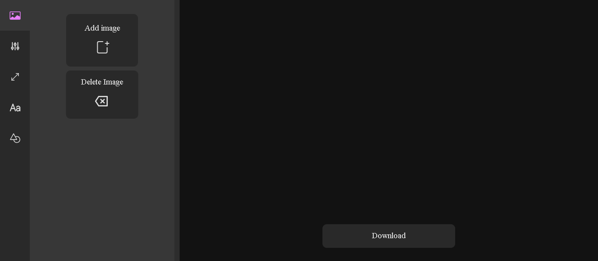
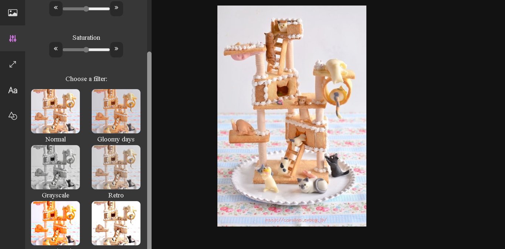
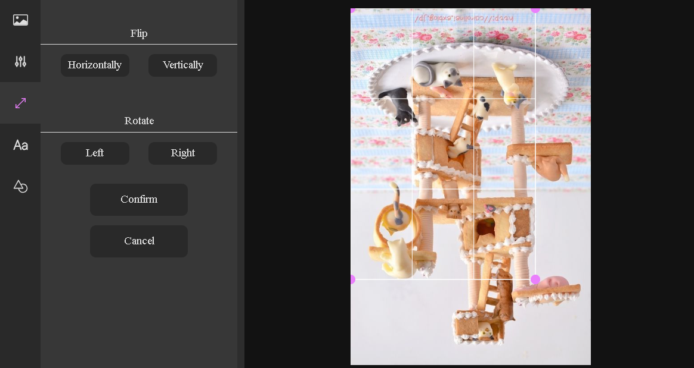
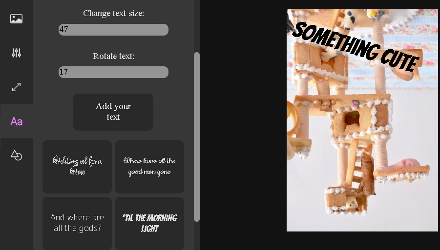
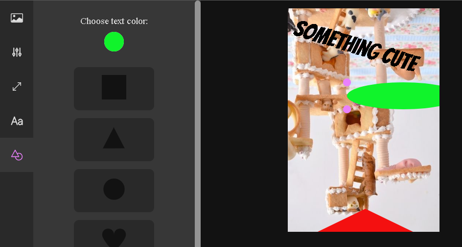

# Photo editor in React!

Project created with:
* CSS
* Javascript
* React
* Webpack

You can change the saturation, brightness and contrast of the image, then rotate or flip it and crop it, add your text and some shapes! 

